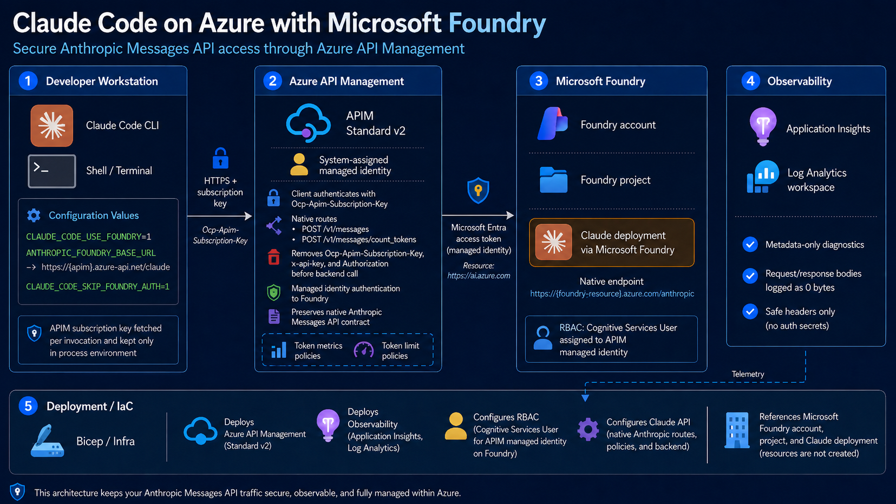

# Claude Desktop and Claude Code on Azure with Microsoft Foundry

Run Claude Desktop or terminal Claude Code through Azure API Management (APIM) and Microsoft Foundry while preserving the native Anthropic Messages API.



The diagram shows the brownfield path. Greenfield also creates the resource group, Foundry account, project, and Claude deployment.

## Deployment Modes

- **Greenfield (default):** creates the full stack: resource group, Foundry account/project/model, APIM Standard v2, RBAC, Log Analytics, and Application Insights.
- **Brownfield:** reuses an existing Foundry account/project/model and deploys only the gateway, observability, and APIM RBAC.

Set `DEPLOYMENT_MODE=greenfield` or `brownfield` in `.env.azure.local`.

## Model Choice

| `CLAUDE_MODEL_FAMILY` | Default Hosted-on-Azure model |
|---|---|
| `opus` | `claude-opus-5` v2 |
| `sonnet` | `claude-sonnet-5` v2 |
| `haiku` | `claude-haiku-4-5` v2 |

Greenfield defaults to Sonnet at 25K TPM. The preflight checks the live regional catalog and the Hosted-on-Azure quota pool before deployment.

## Quickstart

Prerequisites: Azure CLI, `jq`, Git, Bash/Zsh, and current Claude Code (`2.1.203+`). Claude Desktop setup additionally requires macOS 14+ and Claude Desktop `1.21459.0+`.

```bash
git clone https://github.com/msftnadavbh/claudecodepoc.git
cd claudecodepoc
cp .env.azure.example .env.azure.local
# Edit .env.azure.local

./scripts/login-azure.sh
./scripts/register-providers.sh
./scripts/preflight-model.sh
./scripts/validate-infra.sh --gateway
./scripts/deploy.sh

# Choose either or both:
./scripts/configure-claude.sh
./scripts/configure-claude-desktop.sh
```

For terminal Claude Code, restart the shell or source the shell profile printed by the setup script, then run:

```bash
claude
```

For one-off use without changing the shell profile:

```bash
./scripts/claude-apim.sh
```

## Terminal Claude Code Setup

`./scripts/configure-claude.sh` makes plain `claude` use Foundry through APIM automatically:

1. Writes a small launcher to `~/.config/claudecodepoc/claude.sh`.
2. Sources it from `~/.bashrc` or `~/.zshrc`.
3. Routes `claude` to `scripts/claude-apim.sh`.
4. On every launch, fetches the APIM subscription key from Azure without saving it.
5. Sets Foundry mode, the APIM base URL, skipped local Foundry auth, the APIM key header, and model deployment aliases.

Result: after one shell reload, users run normal `claude`; all model traffic goes Claude Code → APIM → Foundry.

## Claude Desktop Setup

`./scripts/configure-claude-desktop.sh` configures Claude Desktop third-party gateway mode for Chat, Cowork, and Code:

1. Validates the macOS installation and the current Claude Desktop version.
2. Refreshes the repository's non-secret `.env.azure.generated` through the existing Azure context checks.
3. Generates and validates an ignored `.claude-runtime/claude-desktop/claudecodepoc-claude-desktop.mobileconfig`.
4. Opens the profile with the supported macOS UI. Approve it in **System Settings → General → Device Management**; macOS does not permit the script to bypass this approval.
5. When run interactively, waits for approval, verifies the managed preference, then fully quits and reopens Claude Desktop.

The profile selects the APIM gateway, disables model discovery, and configures the exact Foundry deployment. `GET /v1/models` is not required. It contains no APIM key, Foundry key, or Azure token. Claude Desktop runs `scripts/claude-desktop-credential-helper.sh` when it needs a credential; the helper validates the repository-local Azure CLI context and fetches the APIM subscription key into memory at runtime.

The helper contains an absolute path to this clone. Keep the repository at that path and keep the existing repository-local Azure CLI login valid. If the clone moves, rerun `./scripts/configure-claude-desktop.sh` and approve the replacement profile. Check the generated and installed configuration without fetching a key:

```bash
./scripts/configure-claude-desktop.sh --check
```

The generated profile uses a stable identifier, so repeated setup runs replace the same profile. To remove it, use **System Settings → General → Device Management**; the script never removes a profile automatically.

MCP tool search starts disabled. First prove the same APIM → Foundry route with an end-to-end Claude Code run:

```bash
ENABLE_TOOL_SEARCH=true ./scripts/run-claude-code-smoke.sh
```

Only after that succeeds, opt in while regenerating the Desktop profile:

```bash
ENABLE_TOOL_SEARCH=true ./scripts/configure-claude-desktop.sh
```

No MCP server is installed or configured by this repository.

## Greenfield Configuration

Greenfield requires globally unique Foundry/APIM names and accurate Marketplace attestation values:

```bash
DEPLOYMENT_MODE=greenfield
CLAUDE_MODEL_FAMILY=sonnet
CLAUDE_MODEL_CAPACITY=25
CLAUDE_ORGANIZATION_NAME="Your legal organization name"
CLAUDE_COUNTRY_CODE=US
CLAUDE_INDUSTRY=technology
```

Deploying accepts the applicable Anthropic Marketplace terms through `modelProviderData`. Review the legal links below and never use placeholder attestation values.

## Brownfield Configuration

Set `DEPLOYMENT_MODE=brownfield` and provide the exact existing resource group, Foundry resource, project, deployment, model, and version. Validation confirms the live resources and Bicep keeps them external and read-only.

## macOS

```bash
brew install --cask claude-code
brew install azure-cli jq
```

Install Claude Desktop from [claude.com/download](https://claude.com/download), then follow the Quickstart. `scripts/configure-claude.sh` detects Zsh and updates `~/.zshrc`. Homebrew Claude Code does not auto-update; use `brew upgrade --cask claude-code`.

## How Authentication Works

- Terminal Claude Code fetches an APIM subscription key at launch and keeps it only in the process environment.
- Claude Desktop fetches the same key through its credential helper and caches the in-memory result for one hour.
- APIM strips client credentials and authenticates to Foundry with its system-assigned managed identity.
- APIM receives `Cognitive Services User` at the Foundry account scope.
- Requests stay in native Anthropic Messages format, including SSE and token counting.
- Diagnostics log metadata and safe headers only; request/response bodies are logged as zero bytes.

## Useful Commands

```bash
./scripts/discover-foundry.sh          # Preview greenfield or verify brownfield
./scripts/validate-infra.sh --gateway  # ARM validation and what-if
./scripts/run-claude-code-smoke.sh     # End-to-end coding-agent test
./tests/test-config.sh                 # Local configuration test
```

Local identifiers, Azure CLI state, generated environment files, deployment evidence, and Claude state are gitignored.

For a production fleet, replace the shared APIM subscription-key mechanism with Claude Desktop interactive Microsoft Entra sign-in. APIM must strictly validate the JWT issuer and audience and authorize each user individually; production OIDC is intentionally outside this proof-of-concept change.

## Sources And Terms

- [Anthropic: Claude Desktop through an LLM gateway](https://claude.com/docs/third-party/claude-desktop/gateway)
- [Anthropic: Claude Desktop configuration reference](https://claude.com/docs/third-party/claude-desktop/configuration)
- [Anthropic: Claude Desktop on Microsoft Foundry](https://claude.com/docs/third-party/claude-desktop/foundry)
- [Anthropic: Claude Code on Microsoft Foundry](https://code.claude.com/docs/en/microsoft-foundry)
- [Anthropic: connect Claude Code to an LLM gateway](https://code.claude.com/docs/en/llm-gateway-connect)
- [Microsoft Learn: deploy Claude with Bicep or Terraform](https://learn.microsoft.com/azure/developer/ai/how-to/deploy-claude-foundry)
- [Microsoft Learn: Claude models in Microsoft Foundry](https://learn.microsoft.com/azure/foundry/foundry-models/concepts/claude-models)
- [Anthropic Commercial Terms](https://www.anthropic.com/legal/commercial-terms)
- [Anthropic Usage Policy](https://www.anthropic.com/legal/aup)
- [Anthropic Supported Regions Policy](https://aka.ms/supported_anthropic_regions)
- [Microsoft Product Terms](https://www.microsoft.com/licensing/terms/)

See [`docs/design.md`](docs/design.md) for protocol and security details.
